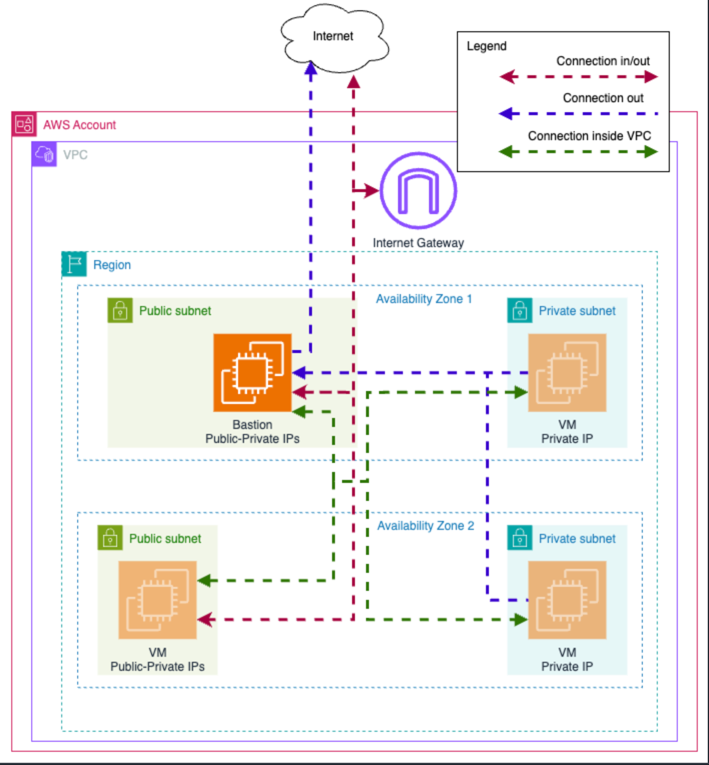

## How to start

1. Install the required CLIs: AWS CLI and Terraform CLI.
2. Configure your AWS credentials using `aws configure` with granted access to AmazonS3FullAccess, IAMFullAccess.
3. Go to the `bootstrap` directory.
4. What is bootstrap?
   - Bootstrap is a Terraform module that creates the necessary resources for the backend configuration.
   - Contains the S3 bucket for state management and lock file.
   - Already applied to the AWS account, so you have to run `terraform init`.
   - If you want to up this infrastructure in another AWS account:
     1. Comment all contents of `bootstrap/backend.tf` (use local state file temporary).
     2. Run `terraform init`, `terraform plan` and `terraform apply` with your own AWS credentials.
     3. Uncomment the contents of `bootstrap/backend.tf`.
     4. Run `terraform init -reconfigure` to reinitialize the backend with the new S3 bucket.
5. Go back to the root directory and run `terraform init`.
6. Edit `terraform.tvars` for your needs (edit GitHub Organization and GitHub repo name) and run `terraform plan` and `terraform apply`.
7. New role for GitHub Actions will be created.

## The infrastructure will be created:
- VPC with public and private subnets (2 public + 2 private).
- Public EC2 instance with SSH access.
- Public EC2 instance.
- 2 Private EC2 instances for each private subnet.

This infrastructure will look like this:

